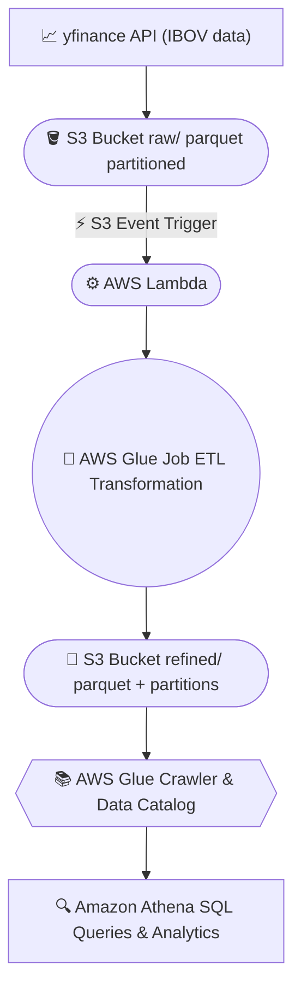

🔗 Repositório: [github.com/aylatilio/b3-dataflow-aws-batch](https://github.com/aylatilio/b3-dataflow-aws-batch.git)

# 🏦 b3-dataflow-aws-batch
Pipeline de dados batch na AWS para ingestão, transformação e análise do índice IBOVESPA, com automação via S3, Lambda, Glue e Athena.

---

## 👩‍💻 Autoria
**Ayla Atilio**  
📚 Pós-graduação em Machine Learning Engineering — FIAP  
🐍 Python | ☁️ AWS | 📊 Data Engineering  
🔗 [linkedin.com/in/aylaatilio](https://linkedin.com/in/aylaatilio)  
🔗 [github.com/aylatilio](https://github.com/aylatilio)

---

## 📘 Visão Geral
Este projeto demonstra a implementação de um **pipeline batch de engenharia de dados** na **AWS**, utilizando dados públicos da **B3 (Bolsa de Valores do Brasil)**.  

O fluxo realiza **ingestão, transformação, catalogação e análise** de dados históricos do **índice IBOVESPA**, com automação baseada em eventos no S3 e consultas via Athena.  
Projeto desenvolvido como parte do **Tech Challenge 2 — FIAP (Machine Learning Engineering)**.

---

### 🚀 Objetivo
Demonstrar um pipeline de **dados escalável, modular e automatizado**, que conecta serviços da AWS em um fluxo **end-to-end**:

**S3 (armazenamento) → Lambda (orquestração) → Glue (ETL) → Athena (análise)**


---


## 🧱 Arquitetura



📈 Fonte de dados: API Yahoo Finance (yfinance)  
💾 Armazenamento: AWS S3 (camadas raw e refined)  
⚙️ Orquestração: AWS Lambda + Glue Job ETL  
📚 Catálogo e Consulta: AWS Glue Catalog + Amazon Athena


---

## 🗂️ Estrutura
```plaintext
b3-dataflow-aws-batch/
│
├── data/
│   ├── raw/                      # dados brutos (Parquet)
│   └── refined/                  # dados transformados localmente
│
├── src/
│   ├── extract_ibov.py           # extração e ingestão de dados do IBOV via yfinance
│   ├── upload_s3.py              # upload automático para o S3 bucket raw/
│   ├── lambda_trigger.py         # função Lambda (dispara o Glue Job)
│   ├── glue_job_etl.py           # ETL rodando no AWS Glue
│   └── glue_job_etl_local.py     # simulação local do Glue Job
│
├── notebooks/
│   ├── athena_queries.ipynb      # consultas e análises via Athena
│   └── ibov_ml_analysis.ipynb    # EDA e modelo preditivo (Regressão Linear)
│
├── docs/                         # documentação e diagramas
│   └── diagrams/
│       ├── architecture.mmd
│       └── architecture.png
│
├── requirements.txt
├── .env.example
└── README.md
```

---


🔄 Pipeline de Execução — End-to-End Flow

| Etapa                         | Ambiente / Serviço       | Descrição                                                                                                 |
| ----------------------------- | ------------------------ | --------------------------------------------------------------------------------------------------------- |
| 🐍 **extract_ibov.py**        | Local (VS Code)          | Extrai dados do índice IBOVESPA via `yfinance` e gera o arquivo parquet bruto (`data/raw/`).              |
| ☁️ **upload_s3.py**           | Local → Amazon S3 (raw)  | Faz o upload automático do parquet gerado para o bucket `b3-dataflow-raw/raw/`.                           |
| ⚡ **lambda_trigger.py**       | AWS Lambda               | Detecta novos arquivos no bucket *raw* e dispara automaticamente o Glue Job `b3-etl-job`.                 |
| 🧩 **glue_job_etl.py**        | AWS Glue                 | Executa o ETL: transforma, renomeia colunas, calcula médias móveis e grava o dataset refinado.            |
| 🧩 **glue_job_etl_local.py**  | Local (VS Code)          | Simula o Glue Job localmente, gerando o parquet `ibov_refined.parquet` em `data/refined/`.                |
| 💾 **Buckets Raw / Refined**  | Amazon S3                | Armazenam as camadas de dados (raw = bruta / refined = transformada) em formato Parquet particionado.     |
| 📚 **Glue Catalog / Crawler** | AWS Glue Data Catalog    | Atualiza o schema e registra a tabela `ibov_refined`, permitindo consulta via Athena.                     |
| 🔍 **athena_queries.ipynb**   | Local → Amazon Athena    | Executa queries SQL sobre os dados refinados via `boto3` e `awswrangler`.                                 |
| 🤖 **ibov_ml_analysis.ipynb** | Local (Jupyter Notebook) | Realiza EDA e treina modelo de **Regressão Linear** com `scikit-learn` para prever o preço de fechamento. |

💡 Essa visão unificada mostra a integração Local ↔ AWS, cobrindo todas as etapas do pipeline:

# Extração → Upload → Orquestração → ETL → Catálogo → Análise → Machine Learning


---


⚙️ Requisitos e Execução do Pipeline

🧩 Pré-requisitos

	Python 3.11.9

Conta AWS com permissões em: S3, Glue, Lambda, Athena, CloudWatch


Credenciais AWS configuradas localmente:

aws configure


Ambiente virtual Python ativo (venv):

python -m venv venv
venv\Scripts\activate
pip install -r requirements.txt


🚀 Etapas de Execução

1️⃣ Ingestão e Upload

python src/extract_ibov.py
python src/upload_s3.py

Extrai e envia dados brutos para b3-dataflow-raw/raw/.


2️⃣ Orquestração via Lambda

A função lambda_trigger.py dispara o Glue Job (b3-etl-job) sempre que um novo arquivo .parquet é adicionado ao bucket raw.

Evento: ObjectCreated:Put
Resultado: parquet refinado em b3-dataflow-refined/refined/.


3️⃣ ETL (Glue / Local)

python src/glue_job_etl_local.py

Realiza transformações, médias móveis e salva data/refined/ibov_refined.parquet.


4️⃣ Catálogo e Consulta (Athena)

jupyter notebook notebooks/athena_queries.ipynb

Executa queries SQL sobre o dataset ibov_refined registrado no Glue Catalog.
Gera estatísticas, volatilidade e amplitude.


5️⃣ Machine Learning

jupyter notebook notebooks/ibov_ml_analysis.ipynb

Lê o parquet refinado e executa:
EDA (estatísticas, visualização temporal)
Regressão Linear (sklearn)
Exibe gráfico de ajuste e métrica R²

💡 Dica: O Glue Job pode ser executado manualmente no console antes de ativar o trigger Lambda, facilitando o debug inicial.

---


🔍 Consulta SQL no Amazon Athena

Após o crawler atualizar o catálogo (b3_refined_db.ibov_refined), as consultas podem ser executadas diretamente no Athena.

```sql
SELECT
    data,
    preco_abertura,
    preco_fechamento,
    (preco_fechamento - preco_abertura) AS variacao_diaria,
    ROUND(((preco_fechamento - preco_abertura) / preco_abertura) * 100, 2) AS variacao_pct,
    volume_negociado
FROM "b3_refined_db"."ibov_refined"
WHERE year = 2025 AND month = 10
ORDER BY data DESC
LIMIT 10;
```

📊 Resultado esperado (amostra):
| data       | preco_abertura | preco_fechamento | variacao_diaria | variacao_pct | volume_negociado |
| ---------- | -------------- | ---------------- | --------------- | ------------ | ---------------- |
| 2025-10-13 | 127.845,00     | 128.430,00       | 585,00          | 0.46 %       | 13 245 200       |
| 2025-10-10 | 128.290,00     | 127.845,00       | −445,00         | −0.35 %      | 12 988 500       |
| …          | …              | …                | …               | …            | …                |


💡 Dataset refinado disponível no Athena, com cálculos derivados e partições atualizadas automaticamente via Glue Crawler.


---


🧠 Machine Learning (Análise Preditiva)

Notebook: notebooks/ibov_ml_analysis.ipynb
Leitura do dataset ibov_refined.parquet
Estatísticas descritivas e gráfico temporal
Modelo LinearRegression (sklearn)
Variável alvo: preco_fechamento
Variável explicativa: media_movel_3d
Métrica de avaliação: R²

💡 ML aplicado, validando a utilidade analítica do dataset refinado.


---


## 🧠 Conclusão

O pipeline demonstra a integração completa de serviços AWS para ingestão, transformação e análise de dados financeiros.
A arquitetura implementa boas práticas de Data Lake (raw/refined), ETL automatizado via Glue e análise via Athena, garantindo escalabilidade e rastreabilidade.
As features geradas (volatilidade, amplitude, médias móveis) servem de base para aplicações de Machine Learning, como detecção de anomalias e previsão de tendências.


---


## 🔗 Referências
- [Yahoo Finance API (yfinance)](https://pypi.org/project/yfinance/)
- [AWS Glue Documentation](https://docs.aws.amazon.com/glue/index.html)
- [Amazon Athena Documentation](https://docs.aws.amazon.com/athena/)
- [Mermaid Live Editor](https://mermaid.live)
