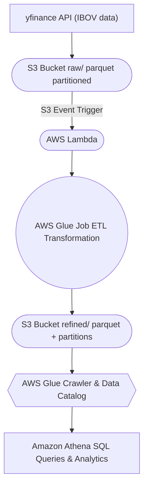

```mermaid
flowchart TD
    A["yfinance API (IBOV data)"] --> B(["S3 Bucket raw/ parquet partitioned"])
    B -->|S3 Event Trigger| C(["AWS Lambda"])
    C --> D(("AWS Glue Job ETL Transformation"))
    D --> E(["S3 Bucket refined/ parquet + partitions"])
    E --> F{{"AWS Glue Crawler & Data Catalog"}}
    F --> G["Amazon Athena SQL Queries & Analytics"]
```
